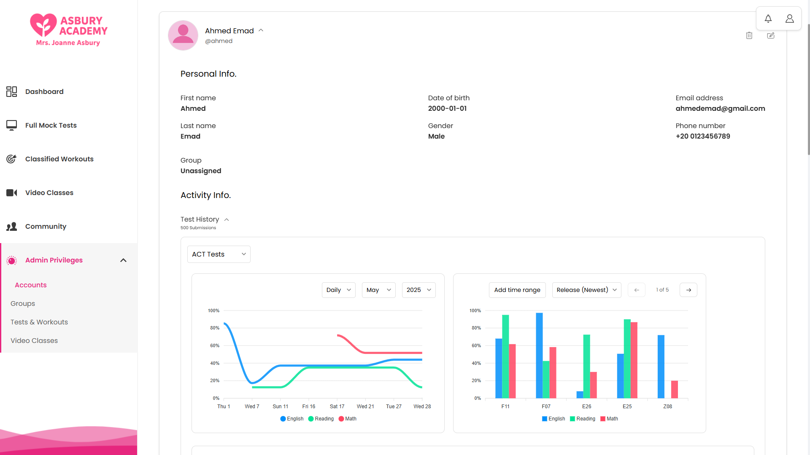
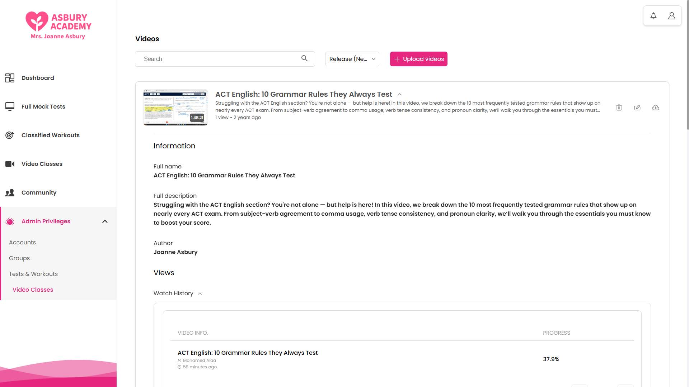

# Asbury Academy

## Overview

This educational platform is specifically designed to support teachers in efficiently managing students and assessing their performance in standardized test preparation, while providing features that help students enhance their test-taking skills and monitor their progress effectively.

---

## Key Features

- **Simulated Standardized Tests:**  
  Students can take practice exams for tests like ACT, SAT, and EST. They can select the type of test and its sections. Tools such as question marking allow students to flag questions for later review.  

- **Detailed Test Results:**  
  Results appear immediately after completing a test, including detailed statistics like time spent per question, incorrect answers, strengths, and weaknesses.  

- **Targeted Mini-Trainings:**  
  The platform offers focused mini-trainings that target specific skills for more precise performance analysis.   

- **Visual Performance Reports:**  
  Graphs compare student performance across different tests and sections, helping identify areas for improvement.  

- **Student Dashboard:**  
  A personalized dashboard summarizes each student's performance, showing progress trends, past test results, and counts of correct and incorrect answers.  

- **Educational Video Library:**  
  A collection of educational videos on various topics and skills. Supervisors and teachers can easily upload new videos to keep the content fresh and diverse.
  
- **Community Page:**  
  This is where students can interact by posting text, images, and attachments. This feature encourages collaboration and sharing among students, allowing them to discuss topics, share resources, and support each other’s learning in a social-media-like environment.

- **Admin Controls:**  
  Advanced tools for managing accounts, organizing groups, and controlling educational content. Teachers can access detailed reports and visual statistics on student or group performance to make informed instructional decisions.  

---

## Screenshots

- **Login Page**

  
  

- **Registration Page**

  
  

- **Student Dashboard**

  
  

- **Test Score Report**

  
  
  

- **Test Overview and History**

  
  

- **Test Selection**

  
  

- **Video Library Page**

  
  

- **Community Page**
  
  
  

- **Admin Controls > Accounts**

  
  
  
  
  
  

- **Admin Controls > Tests**

  
  
  
  

- **Admin Controls > Videos**

  
  
  
  

- **Admin Controls > Edit test content**

  
  

---
